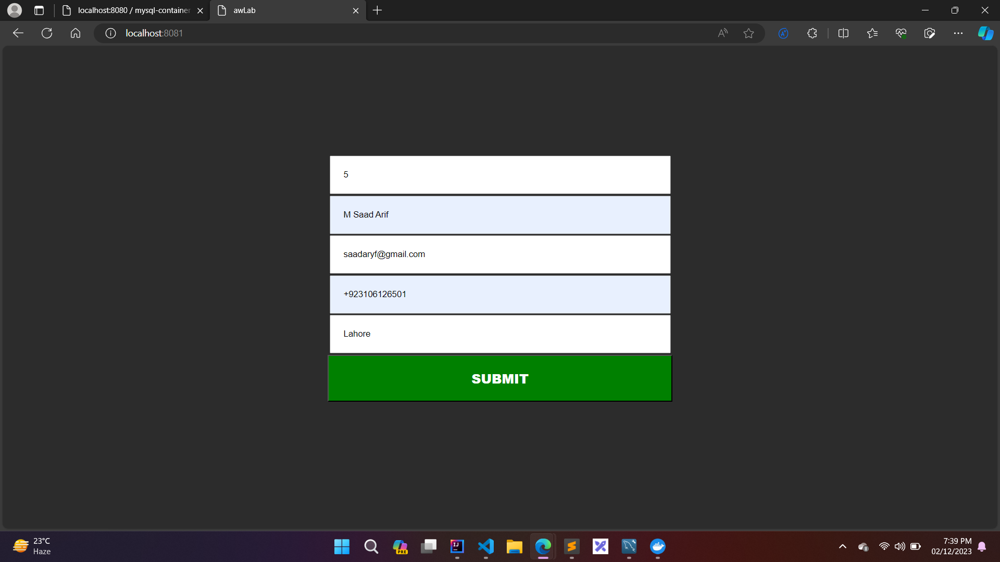
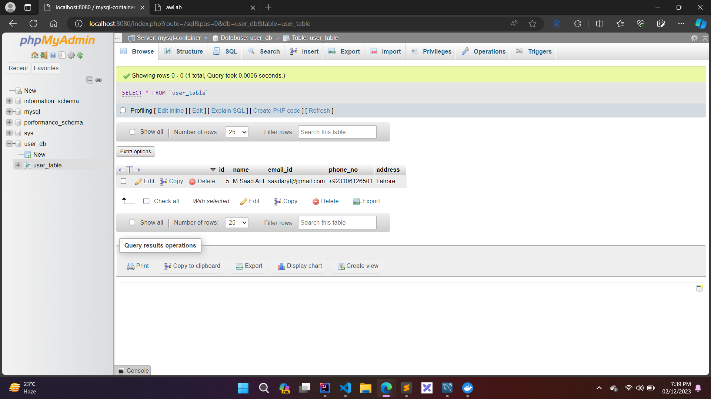

# Docker-PHP-MySQL-UserData

## How to Run/Test This App

### Prerequisites
- Docker should be installed and running on your device.

### Creating Image and Containers
1. Open project in VS Code
2. Open termial using " ctrl + ` "
3. Execute the following commands
   
   ```
   docker build -t my-php-app
   docker-compose up -d
   ```

###  Creating Database
4. Open any browser and visit localhost:8080
5. This will open phpmyadmin. Create a database with name " user_db "
6. Creat table of 5 columns using these names (id, name, email_id, phone_no, address)
7. Set the "id" column as int and the other columns as varchar type.

### Sending User Data
8. Now visit localhost:8081 on your browser
9. Fill in the required fields and submit the form
10. After seeing the success message, visit database to verify data

## Screenshots


